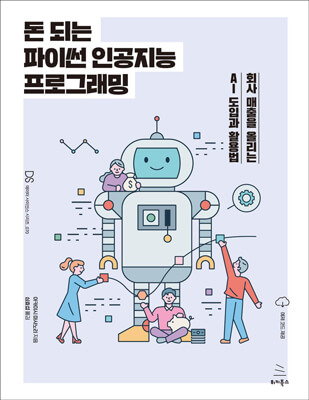

# "역서명" 서포트 사이트 

위키북스에서 출간된 《돈 되는 파이썬 인공지능 프로그래밍》의 소스 코드를 제공하는 저장소입니다.
　
## 실습용 주피터 노트북
 
이 책의 실습용 주피터 노트북 파일은 아래에 있는 "**노트북 파일 일괄 다운로드 방법**"을 통해 한꺼번에 내려받을 수 있습니다. 그리고 이 책의 주피터 노트북 파일은 모두 구글에서 제공하는 "Google Colaboratory" 환경을 전제로 합니다.

* [개별 노트북 파일 설명](refs/notebooks.md)

* [Google Colaboratory](https://colab.research.google.com/notebooks/welcome.ipynb?hl=ko)

아래의 순서대로 진행하면 노트북 파일을 내려받지 않고도 바로 실행할 수 있습니다. 각각의 파일에 담긴 실습 내용에 대해서는 [개별 노트북 파일 설명](refs/notebooks.md)을 참고하기 바랍니다.

## 내용 소개

**내방 고객 수, 주말 수요, 상품 추천…등의 인공지능 기술로 영업과 마케팅이 완전히 새로워진다!  
업무에 유용하고 매출에 도움이 되는 진짜 ‘쓸모 있는 AI’를 직접 만들어 보자!**

업무에 유용한 ‘쓸모 있는 AI’를 만들려면 ‘업무를 보는 안목’과 ‘기술을 보는 안목’이 함께 필요하다. 업무에서 개선이 필요한 부분을 파악하고 그 개선 방안을 도출하는 ‘업무를 보는 안목’은 기존 IT 시스템 도입에도 필요한 능력이었지만, AI를 구축하려면 여기에 더해 업무 개선 방안을 AI를 이용해 구현 가능한지 판단하는 ‘기술을 보는 안목’이 필요하다. 이 책과 함께하는 파이썬 실습을 통해 ‘AI 기술을 보는 안목’을 키워 실질적으로 도움이 되는 유용한 AI를 직접 만들어 볼 수 있다.

- 수식 없이도 알고리즘 선택과 모델 튜닝
- 현장의 눈으로 AI를 최적화
- 웹 브라우저만 있으면 사용할 수 있는 파이썬 실습 환경(Google Colab)
- XGBoost, Prophet 등 화제의 AI 기술 활용
- 예제 코드 전체를 Google Colab에서 사용할 수 있는 노트북으로 제공

업무에 실제 활용 가능한 "유용한 AI"를 만들고 싶다면
"업무 안목"과 "기술적 안목"을 모두 갖춰야 한다.

기존 IT 시스템 도입에서 필요했던 
업무에서 개선이 필요한 부분을 찾고 개선 방안을 찾는 "업무 안목"과 함께
AI로 이 문제를 해결할 수 있는지, 어떤 방식을 활용해야 하는지 깨닫는
"기술적 안목"이 모두 필요하다

이 책을 통해 파이썬을 익히고 "AI를 보는 기술적 안목"을 키우면
누구든지 직접 AI 프로그램을 만들 수 있다.

1장  업무와 머신러닝 프로젝트  
2장  머신러닝 모델의 처리 패턴  
3장  머신러닝 모델을 개발하는 순서  
4장  머신러닝 모델 개발의 중요 포인트  
5장  업무의 요구 조건과 처리 패턴  
・영업 성공 예측(분류)  
・날씨를 이용한 매출 예측(회귀)  
・계절 등 주기성 필드로 매출 예측하기(시계열 분석)  
・추천 상품 제안(연관 분석)  
・계층별 고객 판매 전략(클러스터링, 차원 축소)  
6장  AI 프로젝트를 성공시키기 위한 프로젝트 초기 요령
